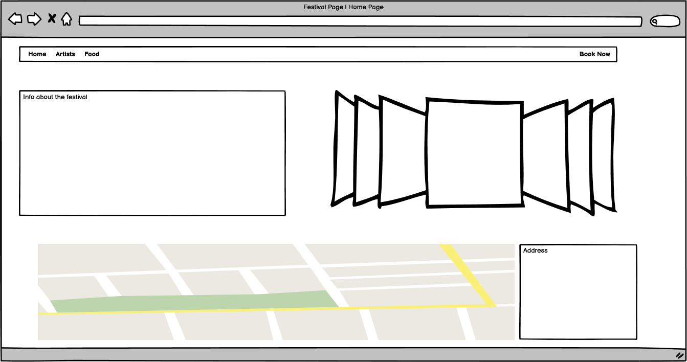
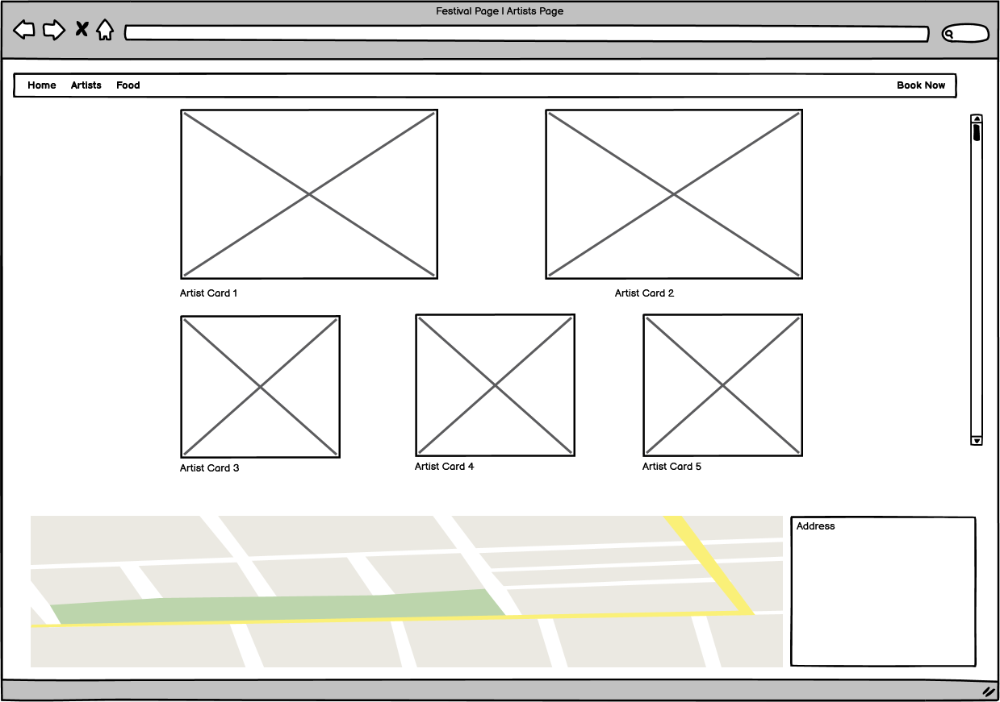
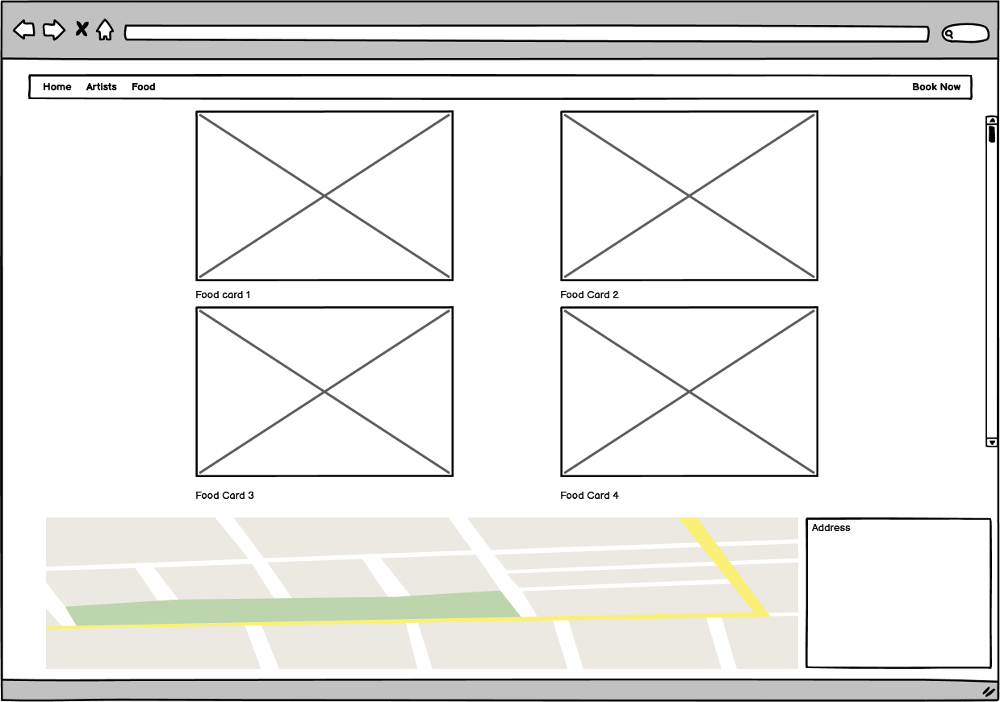
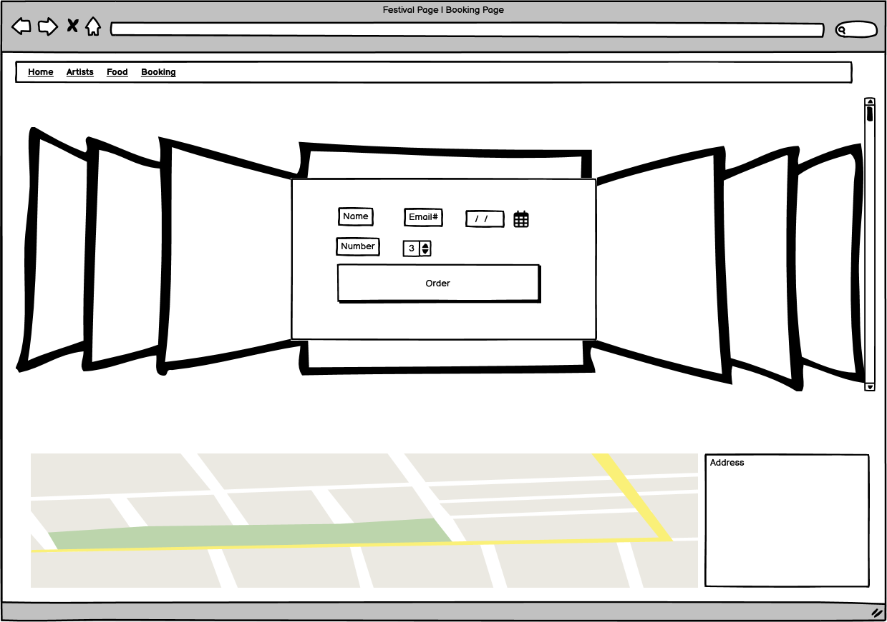
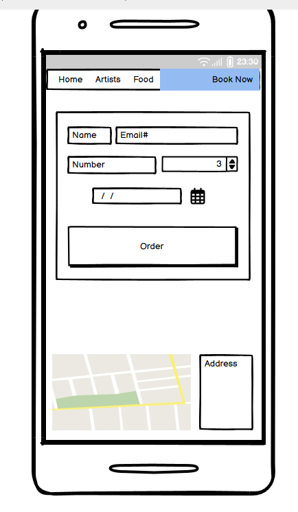
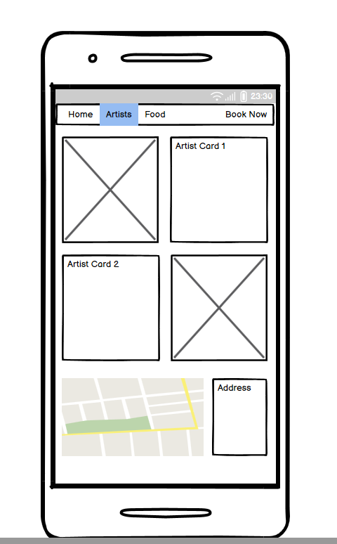
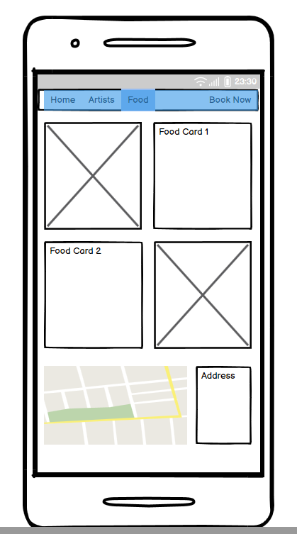

# Through The Trees - Music Festival 

Welcome to the README for the Through The Trees music festival website.

Visit the deployed site: [Through The Trees](https://liambaker93.github.io/Music-festival/index.html)

I wanted to create a site that could showcase similar kinds of content in different ways showcase what I've learnt so far regarding using HTML and CSS together to code a responsive, visually appealing website.

## Table of Contents

1. [Rationale](#rationale)
2. [User Stories](#user-stories)
3. [Wireframes](#wireframes)
    - [Desktop Wireframes](#desktop-wireframes)
    - [Phone Wireframes](#phone-wireframes)
4. [Styling](#styling)
    - [Fonts](#fonts)
    - [Colors](#colours)

## Rationale

This project is designed to showcase the different aspects to a music festival that a user may come to expect, with the goal of allowing the user to quickly and easily submit a request to get a ticket. 

I wanted to make sure that the user was never far away from being able to see the key information that they may feel they need, with their eyeline being drawn towards the main features they need to see. An example of this would be the artists page needing to clearly showcase the headlining acts for both days, and the support acts being supplementary pieces below the main events.

Being able to point the user towards relevant social links was also important to me, hence the inclusion of spotify as a social link as I felt this gave the page some brand cohesion.

One limitation of the project currently was that I imagined there being an audio element to the page, direct spotify links to playlists / specific songs by the artists. Having these would've made the site feel more feature complete as the user would be able to get a better sample of what to expect from the festival. As well as that, not having menus created for the food vendors meant that the links to the menus had to be creative. I opted to have a popup open that alerts the user to the promise of an update in the future regarding the food but, to maintain interest and retention, they can follow links to the social account of the festival and be updated when those elements go live. 

I commented on that modal to allow any future developers of the code to know where the modal is and how it's currently being used, with the idea that specific ones would be created for each food vendor, all four of them currently using the same modal for simplicity.

As it currently stands it's quite a simple site, however it has all the pieces in it to get a small, independent festival ready to showcase exactly what they're all about to any potential music fans in the future. 

## User Stories

- "I don't go to many festivals but particularly want to see one artist and want the flexibility
to go just to see them."

- "I'm a regular festival goer and want to see the variety of artists I can watch, different
timings, and see what food options there are for me."

- "I'm a food vendor and want to be able to sign up to bring  my business to the festival, so will
need a way to contact the organisers."

## Wireframes

### Desktop Wireframes

Going into the wireframing process, I had quite a good idea already of how I wanted the pages to look. 

I knew that I wanted the main call to action button to be the book now button which would remain consistent throughout all the pages.

Specifically with the homepage I wanted to have a carousel of images that would show off the vibe of the festival, with a text box next to it giving a brief description for the user to understand a little about the festival itself. If the description sounded appealing then the aim is for the user to be guided to the Artists page to see who's playing...

With the Artists page, I wanted to use cards to showcase the two main headlining acts, one for Saturday and one for Sunday, and then have a row of cards beneath to show other artists performing. This would give the user the chance to see if anyone they know is performing which would then push them to want to book their tickets to come to the festival.

The Food page was a page I wanted to add to help round out the idea that this was a festival with more to it than just music, and had some actual thought put into it. In terms of layout design, I wanted it to resemble the artists page closely, however I didn't want to give the impression of 'headliner' food options, so opted to have all the cards be the same size and layout.

The final page is the main booking page. On this page I wanted to give the user the option of which dates they wanted to attend as well as the number of tickets they want to order. To make the page more engaging, I planned on putting a carousel of images behind the booking form to liven the page up.

- - -

### Phone Wireframes

The phone designs were designed to just be smaller versions of the main pages, taking away some content where it wouldn't make sense to have on a smaller screen, for example the carousel of images behind the booking form on the booking page. 

   

- - -

## Styling

### Fonts

The first font I found on google fonts was 'Almendra'.

Almendra is the font I've used for all headings in elements.

The next font I found which became the 'secondary-font' variable was 'Raleway'.

### Colours

## Testing

### Code Validation

One of the common info boxes I had show up during the validation process was 'trailing slashes on void elements'. Self closing elements had slashes ahead of the closing tags which the validator flagged as being unneeded so I went through the code on all the pages to eliminate these. 

One warning that was suggested by the validator was having a section which had no heading underneath it. The following is the validator comment, and below is the content displayed on the site:

I then added a H5 element above the table in the modal, to highlight what the box was for which would help with the user experience when it's clicked on. The following is the code I added, and below is the final result of the content:

### Bugs found:

## Deployment

## References (Fonts, bootstrap etc)

### Education Tools

[Digital Ocean helped with troubleshooting issues relating to image sizing within cards](https://www.digitalocean.com/community/tutorials/css-cropping-images-object-fit)

### Design Tools

[Used Google Fonts for fonts](https://fonts.google.com/)

[Used Coolors to generate colour schemes](https://coolors.co/)

[Used Balsamiq for wireframing](https://balsamiq.com/)

### Images

[Used Pexels for stock images](https://pexels.com)

<!--Photos for homepage carousel-->

#### Homepage Images

[Photo by Brett Sayles](https://www.pexels.com/photo/woman-playing-guitar-while-singing-beside-man-playing-bass-guitar-near-microphone-1309240/)

[Photo by Brett Sayles](https://www.pexels.com/photo/woman-playing-guitar-while-singing-beside-man-playing-bass-guitar-near-microphone-1309240/)

[Photo by Jonathan Borba](https://www.pexels.com/photo/view-of-a-concert-with-fireworks-3563173/)

[Photo by Wendy Wei](https://www.pexels.com/photo/photo-of-crowd-during-concert-1190295/)

[Photo by Sebastian Ervi](https://www.pexels.com/photo/silhouette-of-people-in-front-of-stage-1763067/)

[Photo by Sebastian Ervi](https://www.pexels.com/photo/people-in-concert-1763075/)

#### Artists Page Images

<!--Photos for artists cards-->

[Photo by Clam Lo](https://www.pexels.com/photo/photo-of-man-playing-guitar-3469692/)

[Photo by Aleksandr Neplokhov](https://www.pexels.com/photo/band-playing-at-the-street-2601189/)

[Photo by Wendy Wei](https://www.pexels.com/photo/woman-playing-electric-guitar-1864641/)

[Photo by Cottonbro Studio](https://www.pexels.com/photo/man-playing-saxophone-5650950/)

[Photo by Pixabay](https://www.pexels.com/photo/group-of-four-men-rock-band-210887/)

[Photo by Luis Quintero](https://www.pexels.com/photo/woman-singing-on-stage-2091375/)

<!--Photos for Food cards-->

#### Food Page Images

[Photos for the food cards were generated using Google Gemini](gemini.google.com)

[def]: ../music-festival/readme/images/wireframes/home-page-desktop.webp