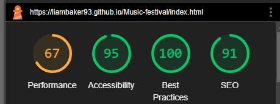

# Through The Trees - Testing

## Contents 

- [Automated Testing](#automated-testing)
    - [W3C Validator](#w3c-validator)
    - [Lighthouse](#lighthouse)

- [Manual Testing](#manual-testing)
    - [Testing User Stories](#testing-user-stories)
    - [Full Testing](#full-testing)

- - -

Initially when building the site I was building it focussing on the user experience on a desktop browser, while paying attention to what kinds of Bootstrap classes and content I was using and how I would be able to add to them and/or edit them to make the site responsive later down the line.

My main tool for checking responsivity across the site was using Google Developer tools within Chrome, to test how the site looked at different screen sizes. When bugs arose, devtools and the inspect tool were key in helping me figure out what elements/features were going wrong and where to help me understand how to fix them.

Each page has been tested for responsivity using Chrome's devtools at a variety of different screen sizes. Different devices have also been used to help me make sure that the website is functional across them.

- - -

## Automated Testing

### W3C Validator

W3C was used to validate all pages of HTML and the CSS style sheet.

- [index.html](./readme/images/testing/index-validation-final.PNG) - Passed with a warning- the warning regards a section of the HTML that doesn't have a heading in it, but this section is a carousel of images which I didn't choose to add a heading to.

- [artists.html](./readme/images/testing/artist-validation.PNG) - Passed with no errors or warning.

- [food.html](./readme/images/testing/food-validation.PNG) - Passed with no errors or warning.

- [booking.html](./readme/images/testing/booking-validation.PNG) - Passed with no errors or warning.

- [success.html](./readme/images/testing/success-validation.PNG) - Passed with no errors or warning.

- [style.css](./readme/images/testing/css-validation.PNG) - Passed with no errors.

- - - 

### Lighthouse

Lighthouse with Chrome's devtools was used to test the responsiveness and accessibility of the website.

#### Desktop Results

It's recommended to run the site in incognito if you would like to run the lighthouse testing yourself, as this way any slowdown or issues arising from installed extensions won't affect the testing.

The first three pages (index, artist & food) all scored lowest on performance. 

The low scores on the performance category were down to the sizing of images within the pages. In hindsight, compressing the image sizes before loading them into the project would most likely have helped this as the load of the content would have been reduced.

#### Mobile Results

The booking page scored the best across all four categories, suggesting again that the pictures are what's slowing the page down due to the booking page having no images depending on the size of the screen.

- - -

### Manual Testing

#### Testing User Stories

`Single Band Supporter`

| Goals | How are they achieved? |
| :--- | :--- |
| I don't go to many festivals and want the flexibility to see one band | The days artists are playing are displayed above them, and in the booking form, the user is given the option to go for the whole weekend or specifically pick a day. |

`Regular Festival goer`

| Goals | How are they achieved? |
| :--- |  :--- |
| I go to festivals often, and want to see multiple artists and food options. | A page highlighting some of the food options that will be available has been made for the user to look at, with links that in future would show a menu to the user. The artist page highlights a variety of artists playing. |

The last user story I had initially was around giving a food vendor the ability to fill out a contact form to bring their food to the festival, however this was a low-priority task for the website and was unable to be completed in the given time.

- - - 

#### Full Testing

Full testing was performed on Google chrome on a Desktop PC and on a Samsung Galaxy S22 Ultra.

`Index page`

| Feature | Expected Outcome | Testing Performed | Result | Pass/Fail |
| --- | ----- | ----- | --- | --- |
| Icon Nav Button | Loads the index page | Clicked on the button | Loads current page | Pass |
| Ticket Booking Button | Loads Booking modal | Click on the link | Loads booking modal | Pass |
| Submitted ticket request | Leads you to success page | Filled in form | Loads success page | Pass |
| Click next/prev buttons on carousel | Selects next/prev picture | Clicked both buttons | Loads correct image | Pass |
| Social Links | Loads expected social site | Clicked each social link | Loaded each correct site/app | Pass
| Nav buttons | Leads user to expected site page | Clicked each nav bar link from homepage | Loaded each page | Pass
| Navbar toggle on small screens | Opens Nav bar | Click navbar menu button | Opened Navbar options | Pass |
| Embedded map | Selecting loads google maps | Clicking on the map | Loaded google maps | Pass |

`Artists Page`

| Feature | Expected Outcome | Testing Performed | Result | Pass/Fail |
| --- | ---- | ---- | --- | --- |
| Icon Nav Button | Loads the index page | Click on the button | Loads back to the homepage | Pass |
| Nav buttons | Leads user to expected site page | Clicked each nav bar link from Artists page | Loaded each correct page | Pass |
| Social Links | Loads expected social site | Clicked each social link | Loaded each correct site/app | Pass |
| Navbar toggle on small screens | Opens Nav bar | Click navbar menu button | Opened Navbar options | Pass |
| Embedded map | Selecting loads google maps | Clicking on the map | Loaded google maps | Pass |

`Food page`

| Feature | Expected Outcome | Testing Performed | Result | Pass/Fail |
| --- | ---- | ---- | --- | --- |
| Icon Nav Button | Loads the index page | Click on the button | Loads back to the homepage | Pass |
| Selecting menu buttons loads a pop up | Loads a pop up directing the user to follow an instagram page | Click on each menu button | Loads pop up | Pass |
| Social links in pop up | Lead to relevant app/site | Click each link in pop up | Taken to relevant site/app | Pass |
| Nav buttons | Leads user to expected site page | Clicked each nav bar link from Artists page | Loaded each correct page | Pass |
| Navbar toggle on small screens | Opens Nav bar | Click navbar menu button | Opened Navbar options | Pass |
| Embedded map | Selecting loads google maps | Clicking on the map | Loaded google maps | Pass |

`Booking page`

| Feature | Expected Outcome | Testing Performed | Result | Pass/Fail |
| --- | ---- | ---- | --- | --- |
| Submit Requirement | Form should not submit if all of the options are not filled | Tried submitting without a name | Page asks for a name to be filled | Pass |
| Submit Requirement | Form should not submit if all of the options are not filled | Tried submitting without an email | Page asks for a name to be filled | Pass |
| Submit Requirement | Form should not submit if all of the options are not filled | Tried submitting without a ticket type | Page asks for a name to be filled | Pass |
| Booking submission | Form should take you to success page when completed fully | Submitted full form with each ticket type | Success page loads | Pass |
| Icon Nav Button | Loads the index page | Click on the button | Loads back to the homepage | Pass |
| Nav buttons | Leads user to expected site page | Clicked each nav bar link from Artists page | Loaded each correct page | Pass |
| Navbar toggle on small screens | Opens Nav bar | Click navbar menu button | Opened Navbar options | Pass |
| Embedded map | Selecting loads google maps | Clicking on the map | Loaded google maps | Pass |

