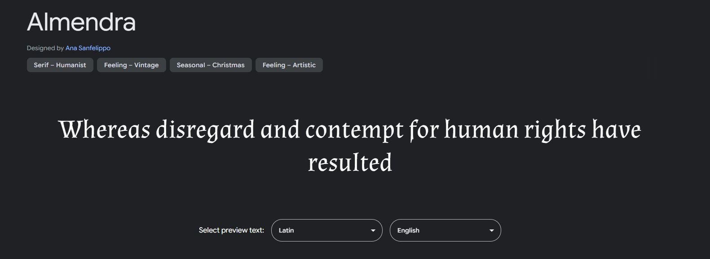

# Project-Milestone-1
 Code Institute milestone project 1 - music festival website

## Initial Wireframes

### Desktop Wireframes

## Styling

### Fonts

The first font I found on google fonts was 'Almendra'.

### Colours

## User Stories

I don't go to many festivals but particularly want to see one artist and want the flexibility
to go just to see them.

I'm a regular festival goer and want to see the variety of artists I can watch, different
timings, and see what food options there are for me. 

I'm a food vendor and want to be able to sign up to bring  my business to the festival, so will
need a way to contact the organisers.

## Testing

### Bugs found:

## Deployment

## References (Fonts, bootstrap etc)

[Used Google Fonts for fonts](https://fonts.google.com/)

[Used Coolors to generate colour schemes](https://coolors.co/)

[Used Balsamiq for wireframing](https://balsamiq.com/)

### Images

[Used Pexels for stock images](https://pexels.com)

<!--Photos for homepage carousel-->

#### Homepage Images

[Photo by Brett Sayles](https://www.pexels.com/photo/woman-playing-guitar-while-singing-beside-man-playing-bass-guitar-near-microphone-1309240/)

[Photo by Brett Sayles](https://www.pexels.com/photo/woman-playing-guitar-while-singing-beside-man-playing-bass-guitar-near-microphone-1309240/)

[Photo by Jonathan Borba](https://www.pexels.com/photo/view-of-a-concert-with-fireworks-3563173/)

[Photo by Wendy Wei](https://www.pexels.com/photo/photo-of-crowd-during-concert-1190295/)

[Photo by Sebastian Ervi](https://www.pexels.com/photo/silhouette-of-people-in-front-of-stage-1763067/)

[Photo by Sebastian Ervi](https://www.pexels.com/photo/people-in-concert-1763075/)

<!--Photos for Food cards-->

#### Food Page Images

[Photos for the food cards were generated using Google Gemini](gemini.google.com)
